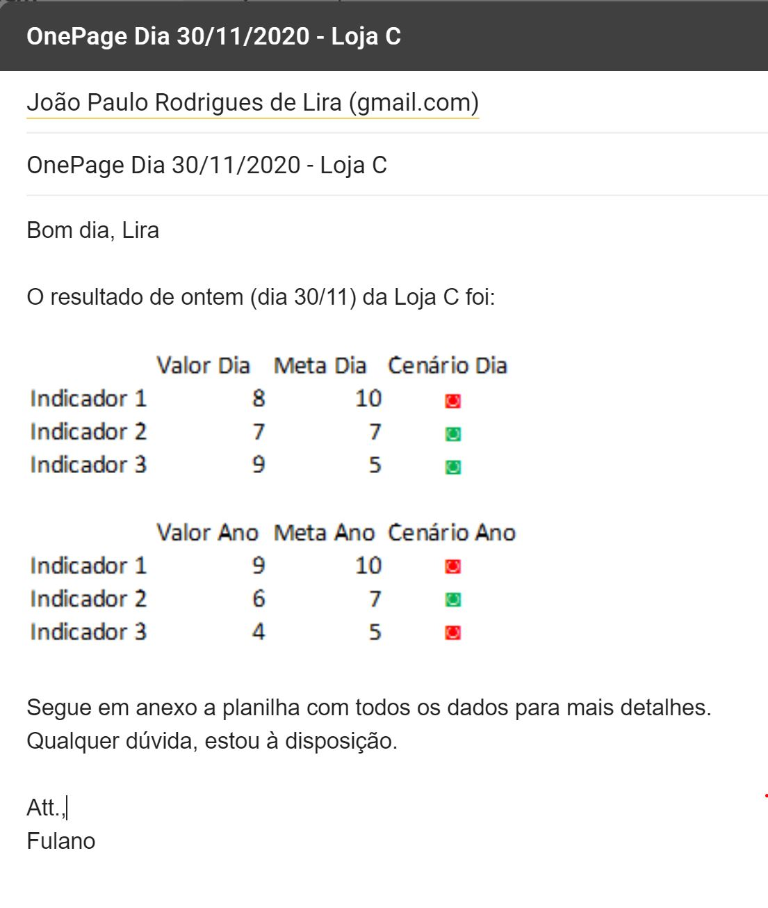

# 🧠 Projeto: Automação de Indicadores

📌 **Curso:** Python Impressionador – Hashtag Treinamentos  
📁 **Repositório:** Automacao-Dados

---

## 🎯 Objetivo

Criar um **projeto completo de automação**, simulando um processo real dentro de uma grande rede de lojas, que envolve:

- Análise de dados
- Geração de indicadores (OnePage)
- Envio automático de e-mails
- Criação de backups
- Geração de relatórios gerenciais

---

## 🧾 Cenário

Você trabalha em uma **rede de 25 lojas de roupas**, espalhadas por todo o Brasil.  
Todo dia, a equipe de análise envia um **OnePage** para cada gerente, contendo os **principais indicadores da loja**.

### O que é um OnePage?

É um **resumo visual simples e direto** para que o gerente possa:

- Avaliar a performance da loja no dia e no ano
- Comparar com outras lojas
- Saber se atingiu ou não as metas estabelecidas

📄 **Exemplo de OnePage:**


📧 **Exemplo de e-mail automatizado:**



---

## ⚙️ Funcionalidades da Automação

✔ Gerar **OnePage individual para cada loja** com base nas vendas  
✔ Enviar um e-mail **personalizado com OnePage e planilha em anexo**  
✔ Garantir que **cada gerente receba apenas os dados da sua loja**  
✔ Criar um **ranking geral** e enviar para a diretoria  
✔ Realizar **backup diário** das planilhas de cada loja

---

## 🗂️ Estrutura dos Arquivos

| Arquivo             | Descrição |
|---------------------|-----------|
| `Emails.xlsx`       | Contém o nome, loja e e-mail dos gerentes e da diretoria. *(Dica: troque os e-mails pelos seus para testar)* |
| `Vendas.xlsx`       | Planilha com todas as vendas de todas as lojas |
| `Lojas.csv`         | Lista com o nome de todas as lojas |
| `onepage.png`       | Exemplo visual de um OnePage gerado |
| `Exemplo.JPG`       | Exemplo de e-mail enviado para os gerentes |

---

## 📊 Indicadores do OnePage

| Indicador              | Meta Anual    | Meta Diária |
|------------------------|---------------|-------------|
| Faturamento            | R$ 1.650.000  | R$ 1.000    |
| Diversidade de Produtos| 120 produtos  | 4 produtos  |
| Ticket Médio           | R$ 500        | R$ 500      |

🔍 Os indicadores devem ser calculados para:
- O **ano inteiro**
- O **último dia** disponível na planilha de vendas

---

## 📤 E-mail da Diretoria

A diretoria recebe um e-mail com:

- 📎 Dois arquivos em anexo:  
  - `Ranking Anual` (baseado no faturamento total)  
  - `Ranking Diário` (baseado no último dia)

- 📝 No corpo do e-mail:
  - Loja com **melhor** e **pior** desempenho do dia
  - Loja com **melhor** e **pior** desempenho no ano

---

## 💾 Backups

Cada planilha individual das lojas deve ser salva em uma pasta com o nome da loja, contendo a **data** no nome do arquivo para gerar um **histórico de backup.**

---

## ✅ Dica para os ícones de verde/vermelho

Use os caracteres especiais de ✔️ e ❌ neste site para facilitar:
🔗 [https://fsymbols.com/keyboard/windows/alt-codes/list/](https://fsymbols.com/keyboard/windows/alt-codes/list/)

Você pode formatar os ícones com HTML no corpo do e-mail, exemplo:

```html
<span style="color:green;">✔️</span> ou <span style="color:red;">❌</span>
